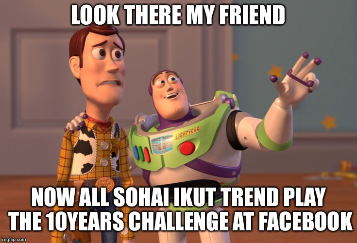
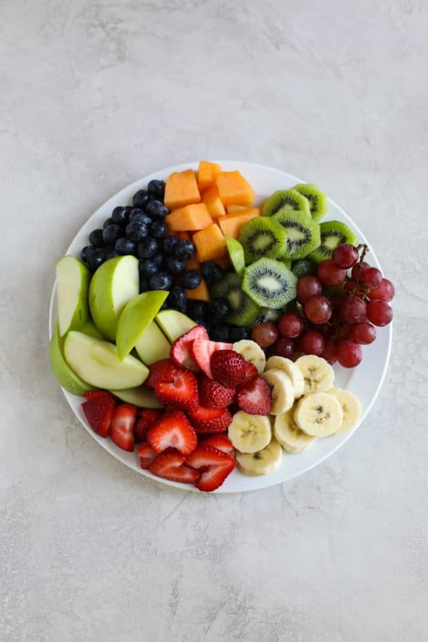
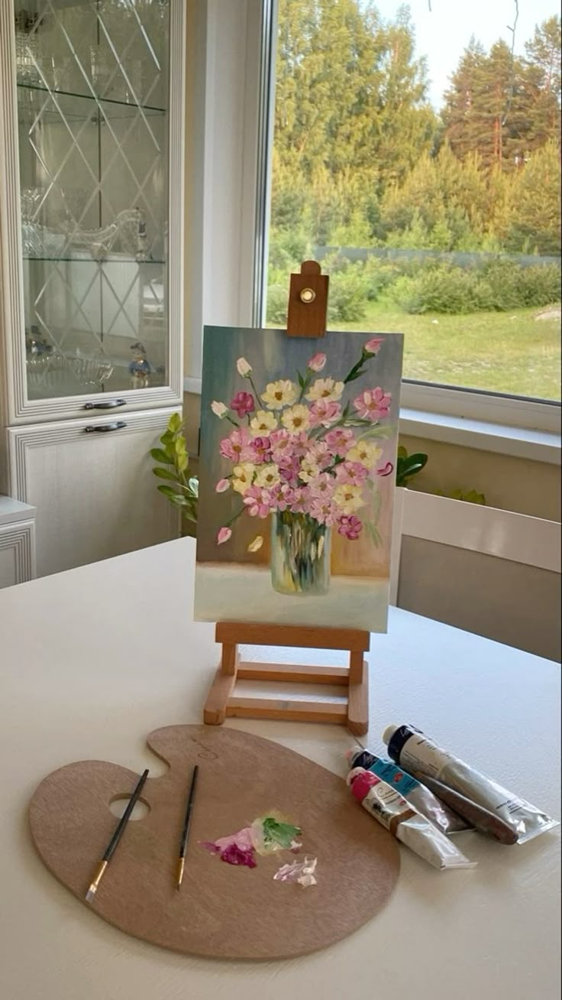
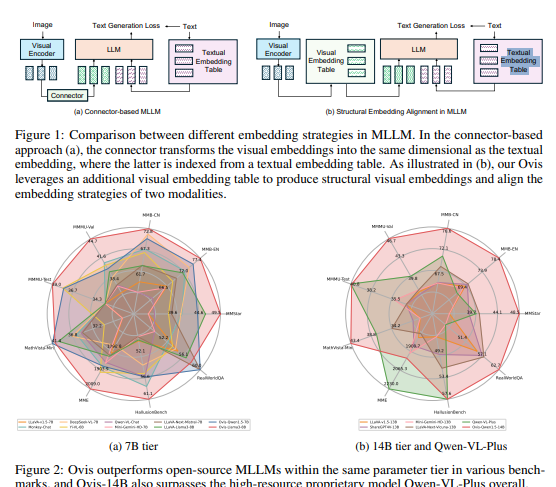

## 👁️‍🗨️ EYEC: Eyes That Speak — Multimodal AI Assistant for Blind People

### A **vision-language multimodal AI system** that helps blind and visually impaired users understand visual content shared on platforms like Instagram. The assistant generates ** humorous, and vivid captions**, and narrates them using **Text-to-Speech (TTS)**.
---

## 📌 Project Description

**EYEC** is an AI-driven assistant that makes visual content accessible for blind users.  
It automatically:

✅ Detects whether an image is a **meme** or **not** using a fine-tuned MobileNetV3 classifier.  
✅ Generates emotionally aware, context-appropriate captions via **Ovis2-4B**, a powerful Multimodal LLM.  
✅ Narrates those captions out loud using **edgeTTS** for a seamless assistive experience.

## 🎥 Demo

Here’s a live example of how **EYEC** describes images for blind users — pairing captions with real-time narration.

---

### 📸 Example 1


**Generated Caption:**  
*“The image features two beloved characters from the Toy Story franchise: Woody and Buzz Lightyear. Woody, dressed in his iconic yellow plaid shirt and cowhide vest, stands with a concerned expression, his hand on Buzz's shoulder. Buzz, in his white and green space suit, points excitedly towards something off-screen, his face beaming with enthusiasm. The background is a simple room with a blue wall and a door, creating a cozy atmosphere. The text overlay reads, "Look there my friend, now all Sohai ikut trend play the 10 years challenge at Facebook," humorously suggesting that the characters are reacting to a popular social media trend. The image captures a moment of contrast between Woody's apprehension and Buzz's excitement, adding a layer of humor to the scene.”*

🎧 [▶️ Listen to audio](https://huggingface.co/datasets/raniatatou/audios/resolve/main/caption_audio1.mp3)
---

### 📸 Example 2


**Generated Caption:**  
*“The image captures a breathtaking view of Paris at sunset, with the iconic Eiffel Tower standing majestically in the background. The sky is painted in warm hues of orange and yellow, creating a serene atmosphere. In the foreground, a balcony adorned with lush white roses adds a touch of romance to the scene. The rooftops of Parisian buildings are visible, showcasing the city's characteristic architecture. This picturesque view perfectly encapsulates the charm and beauty of Paris, making it a quintessential representation of the city.”*

🎧 [▶️ Listen to audio](https://huggingface.co/datasets/raniatatou/audios/resolve/main/caption_audio2.mp3)
---

### 📸 Example 3


**Generated Caption:**  
*“The image shows a colorful fruit platter on a white plate, arranged in a visually appealing manner. The platter includes green apple slices, strawberries, banana slices, red grapes, kiwi slices, blueberries, and cubed cantaloupe. The fruits are neatly separated, creating a vibrant display of colors and textures. The plate is set on a light gray marble countertop, providing a neutral background that highlights the fresh produce. This arrangement is perfect for a healthy snack or dessert, offering a variety of flavors and nutrients in one serving.”*

🎧 [▶️ Listen to audio](https://huggingface.co/datasets/raniatatou/audios/resolve/main/caption_audio3.mp3)
---
### 📸 Example 4


**Generated Caption:**  
*“The image showcases a mouthwatering double cheeseburger with sesame seed buns, featuring two beef patties, melted cheese, lettuce, tomato, and pickles. The burger is presented on a wooden cutting board, with a rich, glossy sauce drizzled over the top. In the background, two more burgers are visible, creating a tempting display. The focus is on the appetizing details of the main burger, highlighting its layers and textures. The scene evokes a sense of indulgence and satisfaction, perfect for burger enthusiasts.”*

🎧 [▶️ Listen to audio](https://huggingface.co/datasets/raniatatou/audios/resolve/main/caption_audio4.mp3)
---
### 📸 Example 5


**Generated Caption:**  
*“The image shows a serene painting session in a bright room. A completed still life of pink and yellow flowers in a glass vase is displayed on a wooden easel. The artist's palette, with two brushes and some paint, sits on a white table. The background features a large window with a view of trees and a white cabinet with glass doors. The scene captures the essence of a peaceful artistic moment, with natural light enhancing the colors and details of the painting.”*

🎧 [▶️ Listen to audio](https://huggingface.co/datasets/raniatatou/audios/resolve/main/caption_audio5.mp3)
---

## 🖼️ Architecture


- **Ovis2-4B** is a **multimodal large language model (MLLM)** has size **4.62 B params** combines a **qwen2.5-3B as an LLM** and **AIMv2 Huge as vision encoder** and a special **visual embedding table**.

- It is higher performant than even some 7B>= large models <=10.

- It has features like **Video and Multi-Image Processing** also **Multilingual Support and OCR**.





- **Benchmark scores of Ovis2-4B** from **opencompass**: 
### 🔍 Ovis2-4B Performance Overview

| Benchmark | Score | Notes |
|----------|-------|--------|
| **OCRBench** | **911** | Highest among all <5B models |
| **MMBench-V1.1** | **81.4** | Strong general understanding |
| **HallusionBench** | **53.8** | Moderate hallucination |
| **MMVet** | **65.5** | Good image captioning quality |
| **RealWorldQA** | **71.1** | Works well on real-world images |
| **AI2D** | **85.7** | Understands structured visuals |
| **MathVista-Mini** | **69.6** | Solid math & logical reasoning |
| **SEEDBench_IMG** | **69.3** | Supports complex reasoning tasks |
| **MMT-Bench_VAL** | **65.2** | Follows instructions well |
| **SEEDBench2_Plus** | **53.1** | Handles advanced multimodal questions |

- Also we got **97.41%** accuracy after fine tuning MobileNetV3 large

## 🛠️ Technologies used
- Python
- Pytorch
- Transformers (Hugging Face)
- Ovis2-4B (multimodal vision-language model)
- MobileNetV3 Large
- edge_tts  (Text-to-Speech)
- Kaggle Datasets
- Pinterest Scraper (gallery-dl)
- Matplotlib
- Jupyter

## ⚙️ Setup & Installation

#### 📥 Clone the repository

```bash
git clone https://github.com/rania3103/EYEC.git
cd EYEC
Create and activate a virtual environment
python3 -m venv .venv
source .venv/bin/activate   # On Windows use: .venv\Scripts\activate
📦 Install dependencies
⚠️ Note: Some packages in requirements.txt are commented — install those manually via pip after this step
pip install -r requirements.txt
Open **notebooks/app.ipynb** 
```
#### 📢 During execution:
- After uploading an image, a "⏳ Generating audio, please wait..." message appears while the caption and audio are being generated.
- Then, the caption is displayed inside the notebook, followed by the generated audio.

#### Tutorial

[![Watch the video]](https://drive.google.com/file/d/1BSqp_SYZbGng_JZ4XpfP8bTTZtvDhfX7/view?usp=sharing)


##📝 Credits

```bibtex
@article{lu2024ovis,
  title={Ovis: Structural Embedding Alignment for Multimodal Large Language Model}, 
  author={Shiyin Lu and Yang Li and Qing-Guo Chen and Zhao Xu and Weihua Luo and Kaifu Zhang and Han-Jia Ye},
  year={2024},
  journal={arXiv:2405.20797}
}

@misc{2023opencompass,
    title={OpenCompass: A Universal Evaluation Platform for Foundation Models},
    author={OpenCompass Contributors},
    howpublished = {\url{https://github.com/open-compass/opencompass}},
    year={2023}
}
```