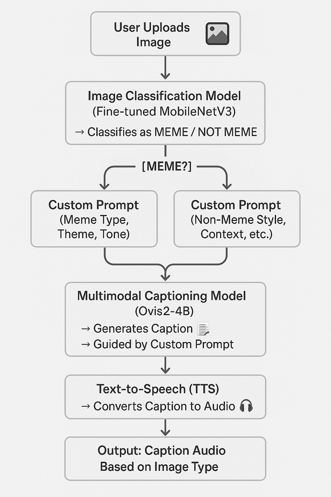

## 👁️‍🗨️ EYEC: Eyes That Speak — Multimodal AI Assistant for Blind People

### A **vision-language multimodal AI system** that helps blind and visually impaired users understand visual content shared on platforms like Instagram. The assistant generates ** humorous, and vivid captions**, and narrates them using **Text-to-Speech (TTS)**.
---

## 📖 Table of Contents

- [Project Description](#project-description)
- [Demo](#demo)
- [Architecture](#architecture)
- [Technologies Used](#technologies-used)
- [Setup & Installation](#setup--installation)
- [Credits](#credits)

## 📌 Project Description

**EYEC** is an AI-driven assistant that makes visual content accessible for blind users.  
It automatically:

✅ Detects whether an image is a **meme** or **not** using a fine-tuned MobileNetV3 classifier.  
✅ Generates emotionally aware, context-appropriate captions via **Ovis2-4B**, a powerful Multimodal LLM.  
✅ Narrates those captions out loud using **gTTS** for a seamless assistive experience.

## 🎥 Demo


## 🖼️ Architecture



- **Ovis2-4B** is a **multimodal large language model (MLLM)** has size **4.62 B params** combines a **qwen2.5-3B as an LLM** and **AIMv2 Huge as vision encoder** and a special **visual embedding table**.

- It is higher performant than even some 7B>= large models <=10.

- It has features like **Video and Multi-Image Processing** also **Multilingual Support and OCR**.


- **Benchmark scores of Ovis2-4B** from **opencompass**: 
### 🔍 Ovis2-4B Performance Overview

| Benchmark | Score | Notes |
|----------|-------|--------|
| **OCRBench** | **911** | Highest among all <5B models |
| **MMBench-V1.1** | **81.4** | Strong general understanding |
| **HallusionBench** | **53.8** | Moderate hallucination |
| **MMVet** | **65.5** | Good image captioning quality |
| **RealWorldQA** | **71.1** | Works well on real-world images |
| **AI2D** | **85.7** | Understands structured visuals |
| **MathVista-Mini** | **69.6** | Solid math & logical reasoning |
| **SEEDBench_IMG** | **69.3** | Supports complex reasoning tasks |
| **MMT-Bench_VAL** | **65.2** | Follows instructions well |
| **SEEDBench2_Plus** | **53.1** | Handles advanced multimodal questions |

- Also we got **97.41%** accuracy after fine tuning MobileNetV3 large

## 🛠️ Technologies used
- Python
- Pytorch
- Transformers (Hugging Face)
- Ovis2-4B (multimodal vision-language model)
- MobileNetV3 Large
- Streamlit (web app)
- edge_tts  (Text-to-Speech)
- Kaggle Datasets
- Pinterest Scraper (gallery-dl)
- Matplotlib
- Jupyter

##⚙️ Setup & Installation
```bash
git clone https://github.com/rania3103/EYEC.git
cd EYEC
python3 -m venv .venv
source .venv/bin/activate
**⚠️ Note**: some comments in requirements.txt u need to download them manually on command line
pip install -r requirements.txt

```

##📝 Credits


@article{lu2024ovis,
  title={Ovis: Structural Embedding Alignment for Multimodal Large Language Model}, 
  author={Shiyin Lu and Yang Li and Qing-Guo Chen and Zhao Xu and Weihua Luo and Kaifu Zhang and Han-Jia Ye},
  year={2024},
  journal={arXiv:2405.20797}
}
@misc{2023opencompass,
    title={OpenCompass: A Universal Evaluation Platform for Foundation Models},
    author={OpenCompass Contributors},
    howpublished = {\url{https://github.com/open-compass/opencompass}},
    year={2023}
}
